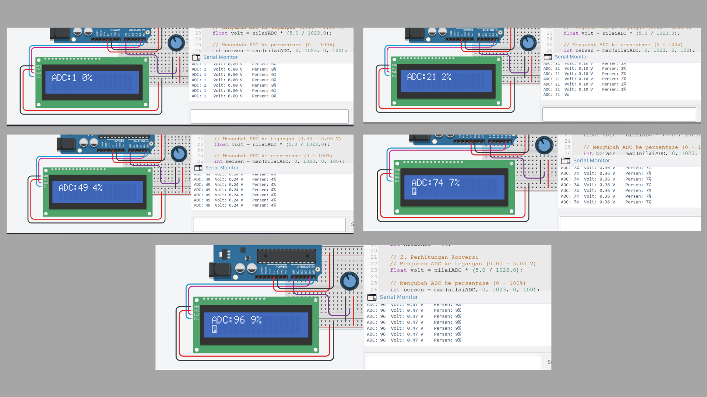

# Jawaban Pertanyaan Praktikum I2C

---

## 1. Jelaskan bagaimana cara kerja komunikasi I2C antara Arduino dan LCD pada rangkaian tersebut! 
Komunikasi I2C pada rangkaian ini menggunakan prinsip arsitektur Master-Slave. Arduino Uno bertindak sebagai **Master** yang mengendalikan jalur komunikasi, sedangkan modul LCD dengan chip PCF8574 bertindak sebagai **Slave**. 

Proses kerjanya bergantung pada dua jalur kabel utama:
* **SDA (Serial Data):** Digunakan untuk mengirimkan data secara dua arah.
* **SCL (Serial Clock):** Digunakan oleh Arduino untuk menghasilkan sinyal *clock* guna mensinkronkan pengiriman bit data.

Agar Arduino bisa mengirim teks hanya ke LCD tanpa mengganggu komponen lain, Arduino akan memanggil alamat unik (I2C Address) milik LCD tersebut terlebih dahulu (misalnya `0x27` atau `0x20`). Setelah alamat cocok, barulah Arduino mengirimkan data teks atau perintah untuk ditampilkan di layar.

---

## 2. Apakah pin potensiometer harus seperti itu? Jelaskan yang terjadi apabila pin kiri dan pin kanan tertukar! 
Pin potensiometer tidak harus seperti pada gambar untuk kaki kiri dan kanannya. 

* **Kaki tengah (Wiper):** Wajib dihubungkan ke pin Analog (A0) karena ini adalah jalur keluaran tegangan yang nilainya berubah-ubah.
* **Kaki kiri dan kanan:** Dihubungkan ke 5V dan GND. 

**Jika pin kiri dan kanan tertukar:** Rangkaian tidak akan rusak atau korsleting. Yang terjadi hanyalah **perubahan arah putaran**. Misalnya, jika sebelumnya diputar ke kanan (searah jarum jam) nilai ADC membesar (0 ke 1023), maka apabila pin VCC dan GND ditukar, diputar ke arah kanan justru akan membuat nilai ADC mengecil (1023 ke 0).

---

## 3. Modifikasi program dengan menggabungkan antara UART dan I2C (keduanya sebagai output)
Hasil modifikasi:


Berikut adalah kode program modifikasi beserta penjelasan per barisnya:

```cpp
#include <Wire.h>                  // Memasukkan library untuk komunikasi I2C
#include <LiquidCrystal_I2C.h>     // Memasukkan library khusus untuk mengontrol LCD I2C

LiquidCrystal_I2C lcd(0x27, 16, 2); // Inisialisasi LCD pada alamat 0x27 dengan ukuran 16 kolom dan 2 baris

const int pinPot = A0;             // Mendeklarasikan pin A0 sebagai jalur input potensiometer

void setup() {
  Serial.begin(9600);              // Memulai komunikasi UART (Serial Monitor) dengan kecepatan 9600 baud rate
  
  lcd.init();                      // Menginisialisasi sistem internal pada LCD
  lcd.backlight();                 // Menyalakan lampu latar (backlight) pada LCD agar teks terlihat
}

void loop() {
  int nilaiADC = analogRead(pinPot);                  // Membaca sinyal analog dari potensiometer (rentang 0-1023)
  
  float volt = nilaiADC * (5.0 / 1023.0);             // Mengonversi nilai ADC menjadi tegangan rill (0.00 V - 5.00 V)
  int persen = map(nilaiADC, 0, 1023, 0, 100);        // Mengubah skala nilai ADC (0-1023) menjadi persentase (0-100%)
  int panjangBar = map(nilaiADC, 0, 1023, 0, 16);     // Mengubah skala nilai ADC menjadi jumlah blok untuk bar LCD (0-16 kolom)

  // OUTPUT SERIAL MONITOR (UART)
  Serial.print("ADC: ");           // Mencetak teks "ADC: " ke Serial Monitor tanpa pindah baris
  Serial.print(nilaiADC);          // Mencetak angka nilai ADC murni
  Serial.print("\t Volt: ");       // Mencetak teks "Volt: " dengan jarak tab (\t)
  Serial.print(volt);              // Mencetak hasil konversi tegangan
  Serial.print(" V");              // Mencetak satuan "V"
  Serial.print("\t Persen: ");     // Mencetak teks "Persen: " dengan jarak tab
  Serial.print(persen);            // Mencetak hasil konversi persentase
  Serial.println("%");             // Mencetak simbol "%" lalu pindah ke baris baru (println)

  // OUTPUT LCD (I2C)
  lcd.setCursor(0, 0);             // Memindahkan kursor LCD ke kolom 0, baris 0 (baris pertama)
  lcd.print("ADC:");               // Mencetak teks "ADC:" di layar LCD
  lcd.print(nilaiADC);             // Mencetak angka nilai ADC di LCD
  lcd.print(" ");                  // Memberikan spasi pemisah
  lcd.print(persen);               // Mencetak angka persentase
  lcd.print("%     ");             // Mencetak simbol "%" ditambah spasi  untuk menimpa sisa digit sebelumnya jika nilai mengecil

  lcd.setCursor(0, 1);             // Memindahkan kursor LCD ke kolom 0, baris 1 (baris kedua)
  for (int i = 0; i < 16; i++) {   // Memulai perulangan (looping) sebanyak 16 kali untuk 16 kolom LCD
    if (i < panjangBar) {          // Mengecek apakah indeks saat ini lebih kecil dari target panjang bar
      lcd.print((char)255);        // Jika ya, cetak karakter kotak penuh (ASCII 255)
    } else {                       // Jika tidak (indeks melebihi panjang bar)
      lcd.print(" ");              // Cetak spasi kosong untuk menghapus sisa bar
    }
  }

  delay(200);                      // Memberikan jeda waktu 200 milidetik sebelum mengulang loop agar pembacaan stabil
}
```

## 4. Tabel Pengamatan Serial Monitor
Hasil Pengamatan:


Tabel di bawah ini merupakan hasil perhitungan dan konversi dari nilai ADC (Analog to Digital Converter) menjadi Tegangan (Volt) dan Persentase (%), sesuai dengan program Arduino yang telah dibuat.

| ADC | Volt (V) | Persen (%) |
| :--- | :--- | :--- |
| 1 | 0.00 | 0 |
| 21 | 0.10 | 2 |
| 49 | 0.24 | 4 |
| 74 | 0.36 | 7 |
| 96 | 0.47 | 9 |
